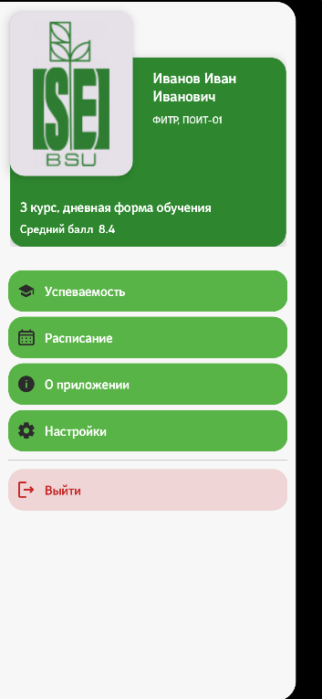
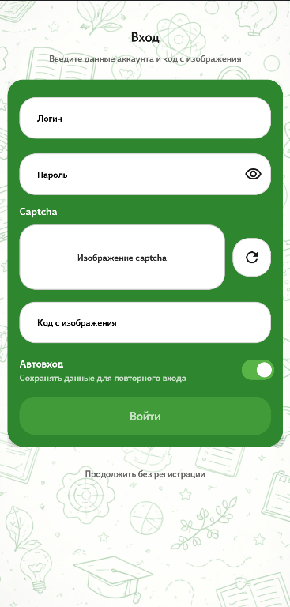
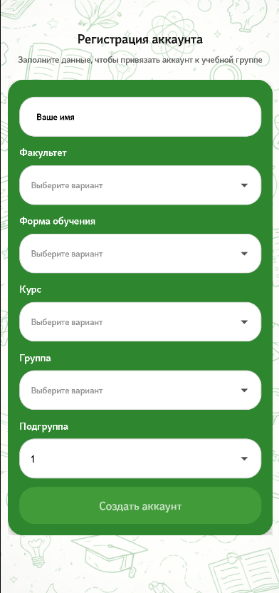
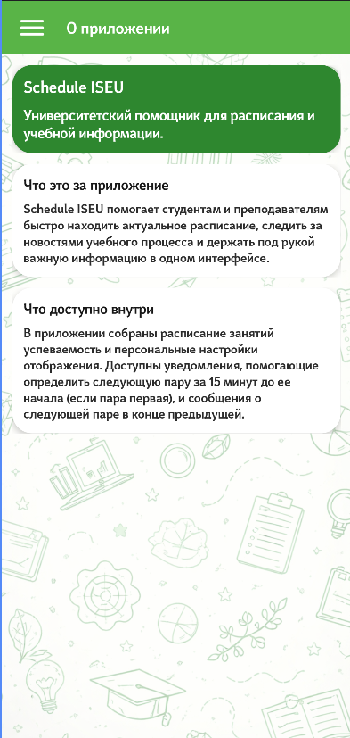

# IseuSchedule V2

An unofficial Android client for university schedules and student cabinet data. It is built for the flows that are inconvenient to repeat in a mobile browser: checking the next lesson, switching weeks, opening academic results, and keeping useful data available when the connection is unstable.


> This is an independent educational project. It is not affiliated with the university.

## Screenshots

| Schedule | Navigation menu |
|---|---|
|  |  |

| Student login | Student registration |
|---|---|
|  |  |

| About |
|---|
|  |

## Features

- Student and teacher schedule browsing with week and day selection.
- Teacher search and a student schedule-only mode that does not require cabinet login.
- Student registration and login flows with captcha handling.
- Academic performance screen with semester switching.
- Room-backed cache for schedules and academic results.
- DataStore preferences for registration state, settings, and saved session context.
- Local lesson notifications for the first lesson, the next lesson, and the end of the study day.
- Schedule restoration after device reboot.

## OCR-Assisted Login

The student login screen downloads the captcha image and uses Google ML Kit text recognition to prefill the input. A preprocessing pass improves contrast before OCR is retried. Recognition is deliberately treated as input assistance: the user can always correct the value before signing in.

## Offline Behavior

Previously loaded schedule weeks and performance data are stored locally. When the network is unavailable, the app can render cached content and expose the offline state in the UI instead of presenting stale data as a live response.

Lesson reminders are also planned from cached timetable data. The app uses `AlarmManager`, creates notification channels in code, and reschedules reminders after reboot through a `BroadcastReceiver`. If exact alarms are not available on a device, scheduling falls back to inexact windows.

## Tech Stack

| Area | Technologies |
|---|---|
| UI | Kotlin, Jetpack Compose, Material 3, Navigation Compose |
| State | ViewModel, Lifecycle, Coroutines, Flow |
| Local data | Room, DataStore Preferences, file-based photo cache |
| Network and parsing | Retrofit, OkHttp, Jsoup |
| OCR | Google ML Kit Text Recognition |
| Notifications | AlarmManager, BroadcastReceiver, notification channels |
| Build | Gradle Kotlin DSL, KSP |

## Project Structure

The code is split by responsibility: Compose screens and view models live under `feature`, reusable UI code under `core`, business models and use cases under `domain`, and persistence, network parsing, OCR, and repository implementations under `data`.

```text
app/src/main/java/com/example/scheduleiseu/
├── app/
├── core/
│   ├── designsystem/
│   └── ui/
├── data/
│   ├── local/
│   ├── mapper/
│   ├── network/
│   ├── ocr/
│   ├── remote/
│   ├── repository/
│   └── session/
├── domain/
├── feature/
│   ├── about/
│   ├── auth/
│   ├── home/
│   ├── menu/
│   ├── navigation/
│   ├── performance/
│   ├── settings/
│   └── whatsnew/
├── notification/
└── MainActivity.kt
```

The notification path is kept separate from the UI: cached schedule data is filtered, converted into the next notification event, scheduled as an alarm, and displayed by a receiver.

## Build

Requirements:

- Android Studio with its bundled JBR
- Android SDK 35
- `minSdk 26`, `targetSdk 35`, `compileSdk 35`

Clone the repository and open it in Android Studio:

```bash
git clone https://github.com/YARIGAVGAN/IseuSchedule_V2.git
cd IseuSchedule_V2
```

Build a debug APK on Windows:

```powershell
.\gradlew.bat assembleDebug
```

Run JVM tests:

```powershell
.\gradlew.bat testDebugUnitTest
```

On macOS or Linux, use `./gradlew` instead of `.\gradlew.bat`.


## Privacy Policy

IseuSchedule does not collect, store, process, or share personal user data.

The application does not require registration and does not gather information such as name, email address, phone number, location, contacts, photos, or any other personally identifiable information.

All data displayed in the application is obtained from publicly available sources and is used exclusively to provide schedule-related functionality.

No user data is sold, shared, or transferred to third parties.

For questions regarding this privacy policy, please contact the repository owner through GitHub.
